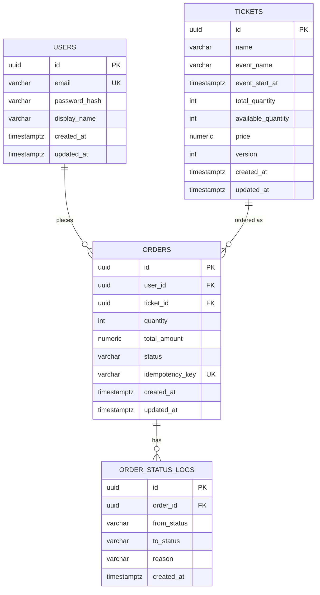

# Data Model Specification

> 本文件定義 Ticket Booking System 的資料庫結構,是後續 API Spec 與 EF Core Entity 設計的唯一依據 (Source of Truth)。
> 任何欄位異動,先改本文件,再改 code。

---

## 0. 主鍵生成策略:UUIDv7,不是 UUIDv4

所有表的 `id` 欄位用 **`uuidv7()`**(PostgreSQL 18 原生函式),不要用 `gen_random_uuid()`(那是 UUIDv4,純亂數)。

**為什麼**:UUIDv4 是完全隨機值,每次 INSERT 會落在 B-tree 索引隨機位置,造成 page split、索引膨脹、寫入效能下降(尤其在高並發搶票這種寫入密集場景更明顯)。UUIDv7 前段編碼時間戳,insert 時自然落在索引尾端,效能接近傳統自增主鍵,同時保留 UUID 全域唯一、適合分散式系統產生的優點。

```sql
-- 每張表的 id 欄位都這樣寫
id uuid PRIMARY KEY DEFAULT uuidv7()
```

EF Core Migration 裡對應寫法:
```csharp
.HasDefaultValueSql("uuidv7()")
```

**已知 trade-off**:UUIDv7 的前段是時間戳,理論上會洩漏資料建立時間,如果 ID 直接對外暴露(本專案就是這樣,ID 會出現在 API 回應裡),外部技術上看得出「大概何時建立」。對本專案這種 demo 場景不構成風險,這是刻意評估過的 trade-off,而不是沒考慮到。

---

## 0.1 EF Core 設定方式:Fluent API,不用 Data Annotations

Entity 上**不要**加 `[Key]`、`[Required]`、`[Column]` 這類 EF Core 的 Data Annotations attribute,一律用 **Fluent API**,設定寫在 `TicketBooking.Infrastructure` 裡,每個 Entity 對應一個獨立的 `IEntityTypeConfiguration<T>` 類別:

```
TicketBooking.Infrastructure/Persistence/Configurations/
├── UserConfiguration.cs
├── TicketConfiguration.cs
├── OrderConfiguration.cs
└── OrderStatusLogConfiguration.cs
```

**為什麼**(對應 `adr-007-clean-architecture-layering.md` 的分層原則):`TicketBooking.Domain` 的 Entity 要保持乾淨,不該知道自己「將來會被存進哪張表、哪個欄位型別」這種持久化細節——這是 Infrastructure 層該管的事。如果在 Entity 上貼滿 EF Core attribute,等於讓 Domain 反過來依賴持久化框架的知識,違反 Clean Architecture「依賴方向只能由外往內」的原則,也讓 `Order.TransitionTo()` 這種封裝行為的 Entity(見 `adr-006`)混進一堆跟業務邏輯無關的標記。

`AppDbContext.OnModelCreating` 裡統一用這行載入所有設定,不用一個一個手動 `ApplyConfiguration`:
```csharp
protected override void OnModelCreating(ModelBuilder modelBuilder)
{
    modelBuilder.ApplyConfigurationsFromAssembly(typeof(AppDbContext).Assembly);
}
```

---

## 1. ER Diagram (邏輯關聯)



---

## 2. 資料表定義

### 2.1 `users`

| 欄位 | 型別 | 約束 | 說明 |
|---|---|---|---|
| id | uuid | PK, default `uuidv7()` | 使用者唯一識別碼(見第 0 節說明) |
| email | varchar(255) | UNIQUE, NOT NULL | 登入帳號 |
| password_hash | varchar(255) | NOT NULL | bcrypt/argon2 雜湊值,**絕不存明碼** |
| display_name | varchar(100) | NOT NULL | 顯示名稱 |
| role | varchar(20) | NOT NULL, default `'User'` | `User` \| `Admin`,寫入 JWT 的 role claim,決定能否呼叫 `/admin/*` |
| created_at | timestamptz | NOT NULL, default now() | |
| updated_at | timestamptz | NOT NULL, default now() | |

**索引**:
- `UNIQUE INDEX idx_users_email ON users(email)`

> `role` 欄位是後續加入的(對應 `docs/4_adr/005-api-versioning-and-rbac.md`),Migration 時用 `ALTER TABLE users ADD COLUMN role varchar(20) NOT NULL DEFAULT 'User'`,不影響既有資料。

---

### 2.2 `tickets`

| 欄位 | 型別 | 約束 | 說明 |
|---|---|---|---|
| id | uuid | PK, default `uuidv7()` | 票券唯一識別碼 |
| name | varchar(200) | NOT NULL | 票種名稱(如「VIP 區」) |
| event_name | varchar(200) | NOT NULL | 活動名稱 |
| event_start_at | timestamptz | NOT NULL | 活動開始時間 |
| total_quantity | int | NOT NULL, `CHECK (total_quantity >= 0)` | 總票數 |
| available_quantity | int | NOT NULL, `CHECK (available_quantity >= 0)` | 剩餘可售票數(**核心防超賣欄位**) |
| price | numeric(10,2) | NOT NULL, `CHECK (price >= 0)` | 單價 |
| version | int | NOT NULL, default 0 | **樂觀鎖版本號**,每次扣庫存時 `+1` |
| created_at | timestamptz | NOT NULL, default now() | |
| updated_at | timestamptz | NOT NULL, default now() | |

**索引**:
- `INDEX idx_tickets_event_start_at ON tickets(event_start_at)`

**防超賣的關鍵設計**:
```sql
-- 扣庫存時必須用這種寫法,version 不符就會影響 0 rows,程式端偵測後重試或失敗
UPDATE tickets
SET available_quantity = available_quantity - :qty,
    version = version + 1,
    updated_at = now()
WHERE id = :ticket_id
  AND version = :expected_version
  AND available_quantity >= :qty;
```
這一條 SQL 就是 ARCHITECTURE.md 裡「DB transaction lock 作為最終防線」的具體實作方式。

---

### 2.3 `orders`

| 欄位 | 型別 | 約束 | 說明 |
|---|---|---|---|
| id | uuid | PK, default `uuidv7()` | 訂單唯一識別碼 |
| user_id | uuid | FK → users.id, NOT NULL | |
| ticket_id | uuid | FK → tickets.id, NOT NULL | |
| quantity | int | NOT NULL, `CHECK (quantity > 0)` | 購買數量 |
| total_amount | numeric(10,2) | NOT NULL | quantity × price(下單當下快照,避免票價異動影響已建立訂單) |
| status | varchar(20) | NOT NULL, default `'Pending'` | 見狀態機文件 |
| idempotency_key | varchar(100) | NOT NULL | 與 user_id 組成複合 UNIQUE（同一用戶不能重複相同 key） |
| created_at | timestamptz | NOT NULL, default now() | |
| updated_at | timestamptz | NOT NULL, default now() | |

**索引**:
- `INDEX idx_orders_user_id ON orders(user_id)`
- `INDEX idx_orders_ticket_id ON orders(ticket_id)`
- `UNIQUE INDEX idx_orders_user_idempotency_key ON orders(user_id, idempotency_key)` — 複合 unique，同一使用者不能重複相同 key，但不同使用者可以有相同 UUID（防止跨用戶授權繞過）

**status 允許值**(對應狀態機):
`Pending` → `Processing` → `Success` | `Failed`

**與 C# 程式碼的對應**:資料庫層存的是文字(`varchar(20)`),對應到 `TicketBooking.Domain.Enums.OrderStatus` 這個 enum,EF Core Configuration 用 `.HasConversion<string>()` 做轉換(見 `docs/4_adr/006-ddd-lite-vs-3tier.md`)。enum 是 C# 型別安全層的決定,不影響資料庫實際儲存的型別。

---

### 2.4 `order_status_logs`

| 欄位 | 型別 | 約束 | 說明 |
|---|---|---|---|
| id | uuid | PK, default `uuidv7()` | |
| order_id | uuid | FK → orders.id, NOT NULL | |
| from_status | varchar(20) | NULL(初始狀態為 NULL) | |
| to_status | varchar(20) | NOT NULL | |
| reason | varchar(500) | NULL | 例如 `"insufficient_inventory"` |
| created_at | timestamptz | NOT NULL, default now() | |

**用途**:
- 這張表不是必要功能,是**額外的加分設計**——證明有考慮到「可追溯性」(auditability),被問到「訂單失敗要怎麼 debug」時可以直接展示這張表。
- 每次 BackgroundService 處理訂單狀態轉換時,同一個 DB transaction 內寫入一筆 log。

---

## 3. 為什麼這樣設計(常見技術提問對照)

| 設計決策 | 常見提問 | 回答重點 |
|---|---|---|
| `tickets.version` 樂觀鎖 | 為什麼不用 `SELECT FOR UPDATE`? | 悲觀鎖在高併發下會造成 lock 等待、吞吐量下降;樂觀鎖用 CAS(compare-and-swap)方式,失敗就重試,搭配 Redis 預檢後,DB 層真正衝突的機率很低 |
| `orders.idempotency_key` | 使用者網路不穩重複送出怎麼辦? | client 產生 UUID 當 idempotency key,DB unique constraint 保證同一個 key 只會建立一筆訂單 |
| `total_amount` 存快照而非即時算 | 為什麼不用 `quantity * tickets.price` 動態算? | 訂單金額不該隨商品價格異動而改變,這是財務資料的基本原則(immutability of financial records) |
| `order_status_logs` 獨立表 | 為什麼不在 orders 表加幾個 timestamp 欄位就好? | 狀態轉換次數不固定(可能重試多次),獨立表可以完整記錄每一次轉換,支援未來做 SLA 分析(每個狀態停留多久) |

---

## 4. 下一步

這份 data model 定案後,建議接著做:

1. `docs/3_specs/domain-state-machine.md` — 把上面提到的 status 轉換規則細化(哪些轉換合法、誰觸發)
2. `docs/3_specs/api-spec.yaml` — 用 OpenAPI 定義 `POST /orders` 等 endpoint,request/response 直接對應這裡的欄位
3. EF Core Entity + Migration — 這時候才真正寫 code,並且 code 要能回頭對照這份文件檢查有沒有漏欄位