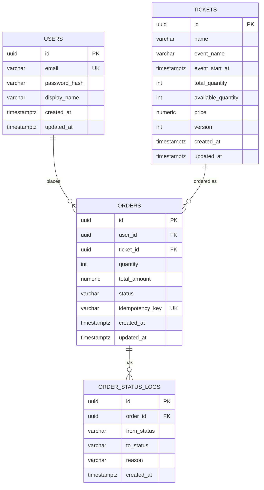

# Data Model Specification

> 本文件定義 Ticket Booking System 的資料庫結構,是後續 API Spec 與 EF Core Entity 設計的唯一依據 (Source of Truth)。
> 任何欄位異動,先改本文件,再改 code。

---

## 1. ER Diagram (邏輯關聯)



---

## 2. 資料表定義

### 2.1 `users`

| 欄位 | 型別 | 約束 | 說明 |
|---|---|---|---|
| id | uuid | PK, default `gen_random_uuid()` | 使用者唯一識別碼 |
| email | varchar(255) | UNIQUE, NOT NULL | 登入帳號 |
| password_hash | varchar(255) | NOT NULL | bcrypt/argon2 雜湊值,**絕不存明碼** |
| display_name | varchar(100) | NOT NULL | 顯示名稱 |
| role | varchar(20) | NOT NULL, default `'User'` | `User` \| `Admin`,寫入 JWT 的 role claim,決定能否呼叫 `/admin/*` |
| created_at | timestamptz | NOT NULL, default now() | |
| updated_at | timestamptz | NOT NULL, default now() | |

**索引**:
- `UNIQUE INDEX idx_users_email ON users(email)`

> `role` 欄位是後續加入的(對應 `adr/005-api-versioning-and-rbac.md`),Migration 時用 `ALTER TABLE users ADD COLUMN role varchar(20) NOT NULL DEFAULT 'User'`,不影響既有資料。

---

### 2.2 `tickets`

| 欄位 | 型別 | 約束 | 說明 |
|---|---|---|---|
| id | uuid | PK | 票券唯一識別碼 |
| name | varchar(200) | NOT NULL | 票種名稱(如「VIP 區」) |
| event_name | varchar(200) | NOT NULL | 活動名稱 |
| event_start_at | timestamptz | NOT NULL | 活動開始時間 |
| total_quantity | int | NOT NULL, `CHECK (total_quantity >= 0)` | 總票數 |
| available_quantity | int | NOT NULL, `CHECK (available_quantity >= 0)` | 剩餘可售票數(**核心防超賣欄位**) |
| price | numeric(10,2) | NOT NULL, `CHECK (price >= 0)` | 單價 |
| version | int | NOT NULL, default 0 | **樂觀鎖版本號**,每次扣庫存時 `+1` |
| created_at | timestamptz | NOT NULL, default now() | |
| updated_at | timestamptz | NOT NULL, default now() | |

**索引**:
- `INDEX idx_tickets_event_start_at ON tickets(event_start_at)`

**防超賣的關鍵設計**:
```sql
-- 扣庫存時必須用這種寫法,version 不符就會影響 0 rows,程式端偵測後重試或失敗
UPDATE tickets
SET available_quantity = available_quantity - :qty,
    version = version + 1,
    updated_at = now()
WHERE id = :ticket_id
  AND version = :expected_version
  AND available_quantity >= :qty;
```
這一條 SQL 就是 ARCHITECTURE.md 裡「DB transaction lock 作為最終防線」的具體實作方式。

---

### 2.3 `orders`

| 欄位 | 型別 | 約束 | 說明 |
|---|---|---|---|
| id | uuid | PK | 訂單唯一識別碼 |
| user_id | uuid | FK → users.id, NOT NULL | |
| ticket_id | uuid | FK → tickets.id, NOT NULL | |
| quantity | int | NOT NULL, `CHECK (quantity > 0)` | 購買數量 |
| total_amount | numeric(10,2) | NOT NULL | quantity × price(下單當下快照,避免票價異動影響已建立訂單) |
| status | varchar(20) | NOT NULL, default `'Pending'` | 見狀態機文件 |
| idempotency_key | varchar(100) | UNIQUE, NOT NULL | 防止使用者重複點擊送出重複訂單 |
| created_at | timestamptz | NOT NULL, default now() | |
| updated_at | timestamptz | NOT NULL, default now() | |

**索引**:
- `INDEX idx_orders_user_id ON orders(user_id)`
- `INDEX idx_orders_ticket_id ON orders(ticket_id)`
- `UNIQUE INDEX idx_orders_idempotency_key ON orders(idempotency_key)`

**status 允許值**(對應狀態機):
`Pending` → `Processing` → `Success` | `Failed`

---

### 2.4 `order_status_logs`

| 欄位 | 型別 | 約束 | 說明 |
|---|---|---|---|
| id | uuid | PK | |
| order_id | uuid | FK → orders.id, NOT NULL | |
| from_status | varchar(20) | NULL(初始狀態為 NULL) | |
| to_status | varchar(20) | NOT NULL | |
| reason | varchar(500) | NULL | 例如 `"insufficient_inventory"` |
| created_at | timestamptz | NOT NULL, default now() | |

**用途**:
- 這張表不是必要功能,是**面試加分項**——證明你有設計「可追溯性」(auditability),面試官問「訂單失敗要怎麼 debug」時可以直接展示這張表。
- 每次 BackgroundService 處理訂單狀態轉換時,同一個 DB transaction 內寫入一筆 log。

---

## 3. 為什麼這樣設計(對應面試常見提問)

| 設計決策 | 面試官可能問 | 你的回答重點 |
|---|---|---|
| `tickets.version` 樂觀鎖 | 為什麼不用 `SELECT FOR UPDATE`? | 悲觀鎖在高併發下會造成 lock 等待、吞吐量下降;樂觀鎖用 CAS(compare-and-swap)方式,失敗就重試,搭配 Redis 預檢後,DB 層真正衝突的機率很低 |
| `orders.idempotency_key` | 使用者網路不穩重複送出怎麼辦? | client 產生 UUID 當 idempotency key,DB unique constraint 保證同一個 key 只會建立一筆訂單 |
| `total_amount` 存快照而非即時算 | 為什麼不用 `quantity * tickets.price` 動態算? | 訂單金額不該隨商品價格異動而改變,這是財務資料的基本原則(immutability of financial records) |
| `order_status_logs` 獨立表 | 為什麼不在 orders 表加幾個 timestamp 欄位就好? | 狀態轉換次數不固定(可能重試多次),獨立表可以完整記錄每一次轉換,支援未來做 SLA 分析(每個狀態停留多久) |

---

## 4. 下一步

這份 data model 定案後,建議接著做:

1. `specs/domain-state-machine.md` — 把上面提到的 status 轉換規則細化(哪些轉換合法、誰觸發)
2. `specs/api-spec.yaml` — 用 OpenAPI 定義 `POST /orders` 等 endpoint,request/response 直接對應這裡的欄位
3. EF Core Entity + Migration — 這時候才真正寫 code,並且 code 要能回頭對照這份文件檢查有沒有漏欄位