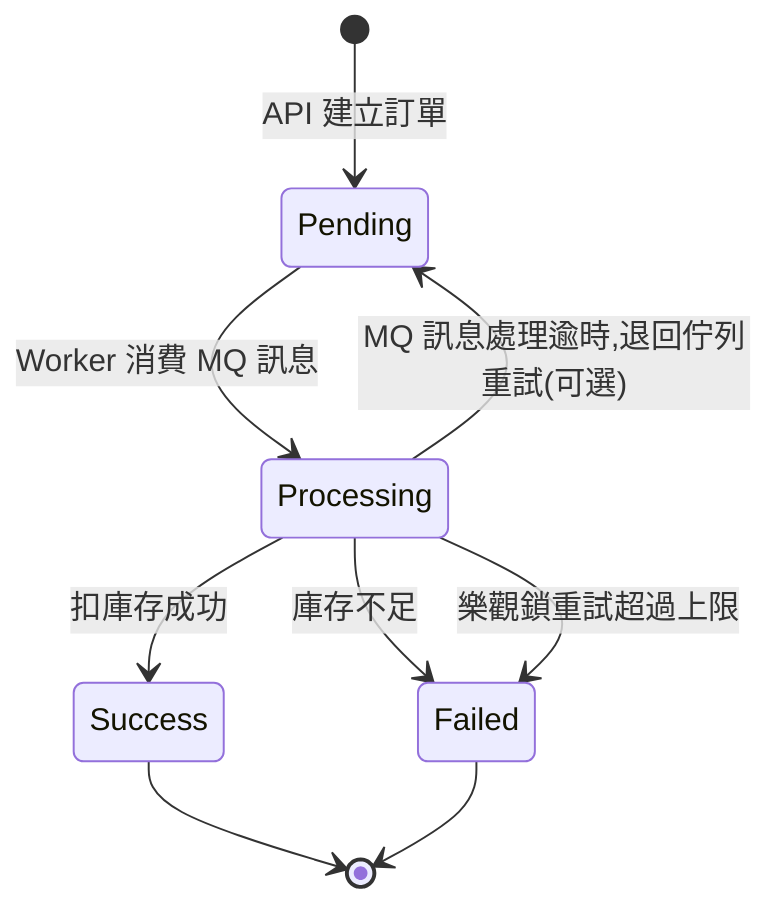

# Domain State Machine Specification

> 定義 `orders.status` 的所有合法轉換規則。任何程式碼要做狀態轉換前,先檢查是否符合本文件定義的規則,不合法的轉換應直接拋出 domain exception,並寫入 `order_status_logs`。

---

## 1. 狀態定義

| 狀態 | 說明 | 是否為終態 |
|---|---|---|
| `Pending` | 訂單剛建立,尚未進入非同步處理流程 | 否 |
| `Processing` | BackgroundService 已從 RabbitMQ 取出訊息,正在執行庫存扣減 | 否 |
| `Success` | 庫存扣減成功,訂單確定成立 | **是** |
| `Failed` | 庫存不足 / 樂觀鎖衝突超過重試次數 / 系統例外 | **是** |

---

## 2. 狀態轉換圖



---

## 3. 合法轉換表

| From | To | 觸發者 | 條件 |
|---|---|---|---|
| (無,新建) | `Pending` | API `POST /orders` | idempotency_key 檢查通過 |
| `Pending` | `Processing` | BackgroundService | 成功從 RabbitMQ 取出對應訊息 |
| `Processing` | `Success` | BackgroundService | `UPDATE tickets ... WHERE version = :expected` 影響列數 = 1 |
| `Processing` | `Failed` | BackgroundService | `available_quantity < quantity`,或樂觀鎖重試達上限(建議 3 次) |
| `Processing` | `Pending` | BackgroundService | MQ 訊息 nack,等待重新投遞(選配,需搭配 dead-letter queue 避免無限重試) |

**不允許的轉換**(程式必須主動擋下並記錄):
- `Success` → 任何狀態(終態不可逆)
- `Failed` → 任何狀態(終態不可逆,若要重新下單應該是建立新訂單,而不是復活舊訂單)
- `Pending` → `Success`(必須經過 `Processing`,不可跳級)

---

## 4. 樂觀鎖重試邏輯(對應 data-model.md 的 `tickets.version`)

```
重試計數 = 0
迴圈:
    讀取 ticket 目前 available_quantity 與 version
    若 available_quantity < 訂單數量:
        → 轉移到 Failed,reason = "insufficient_inventory"
        → 結束
    嘗試 UPDATE ... WHERE version = 讀到的 version
    若影響列數 == 1:
        → 轉移到 Success
        → 結束
    否則(代表有其他請求搶先更新了 version):
        重試計數 += 1
        若重試計數 > 3:
            → 轉移到 Failed,reason = "optimistic_lock_retry_exhausted"
            → 結束
        繼續迴圈
```

**專業的講法**:這是「CAS(Compare-And-Swap)+ bounded retry」模式,避免無限重試造成 thread 卡死,同時保留在真實衝突下讓部分請求成功、部分優雅失敗的能力。

---

## 5. 每個轉換都要寫 `order_status_logs`

| from_status | to_status | reason 範例 |
|---|---|---|
| NULL | Pending | `"order_created"` |
| Pending | Processing | `"worker_picked_up"` |
| Processing | Success | `"inventory_deducted"` |
| Processing | Failed | `"insufficient_inventory"` / `"optimistic_lock_retry_exhausted"` |

這張 log 表的價值:被問到「使用者說他搶票失敗,你怎麼查?」時,你可以直接展示「查這張表就知道是哪一步、哪個 reason 失敗的」,這是很多新手專案不會做但資深工程師會在意的細節。

---

## 6. 與 Architecture.md 的對應

這份狀態機補足了 ARCHITECTURE.md 第 4 節「核心流程設計(搶票)」裡 Step 5、Step 6 沒講清楚的細節——「BackgroundService 處理訂單」實際上包含庫存檢查、樂觀鎖重試、狀態轉換三個子步驟,現在都有精確定義了。

---

## 7. 下一步

1. `docs/3_specs/api-spec.yaml` — 定義 `POST /orders`、`GET /orders/{id}` 等 endpoint,回應內容要能反映這裡的狀態
2. `docs/3_specs/message-contracts.md` — 定義 RabbitMQ 訊息的 payload 格式與 dead-letter queue 設計
3. `docs/5_ops/load-testing-plan.md` — 依照你的硬體條件(M5 / 24GB)調整過的壓測計畫